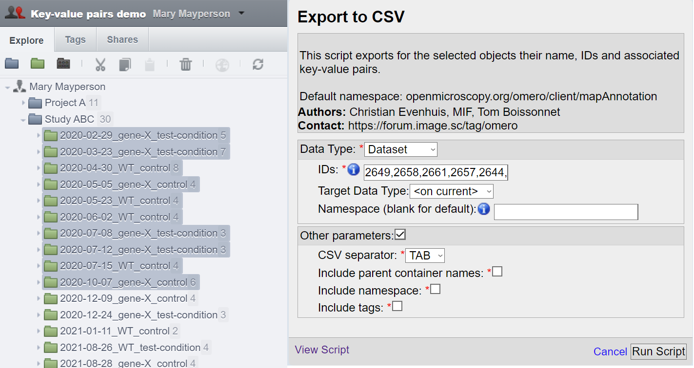
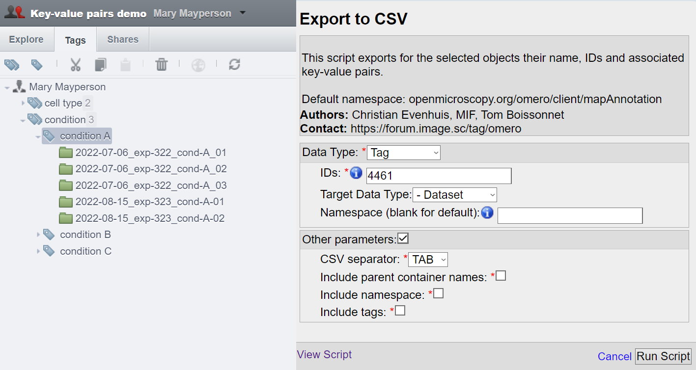
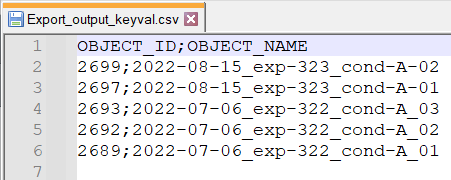
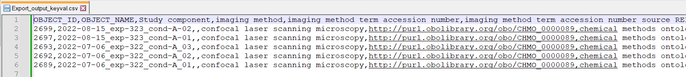
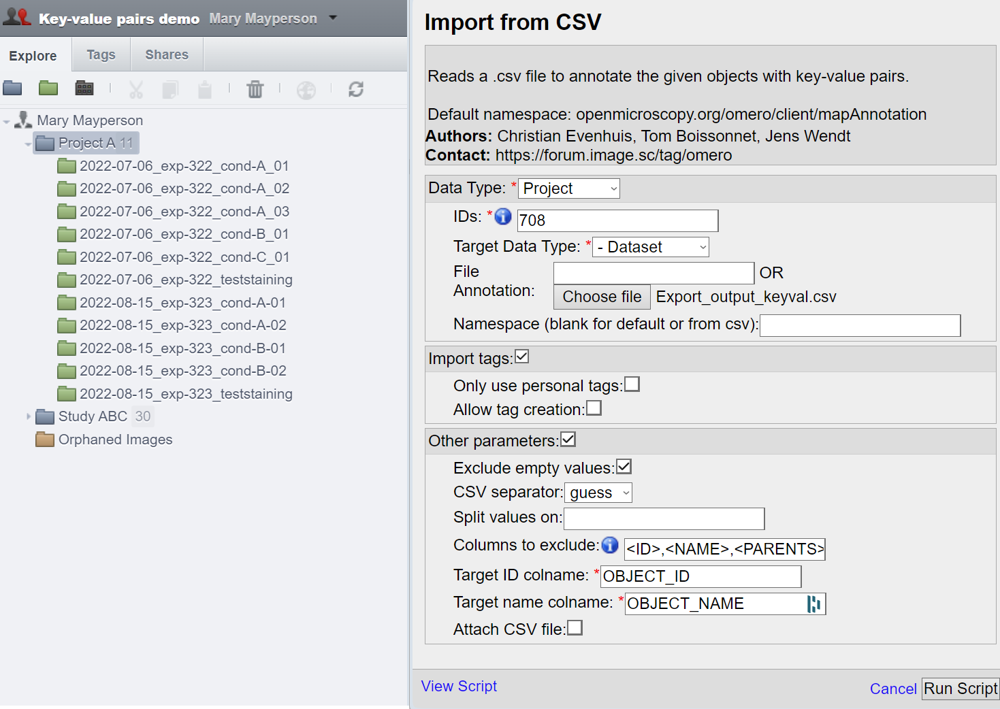
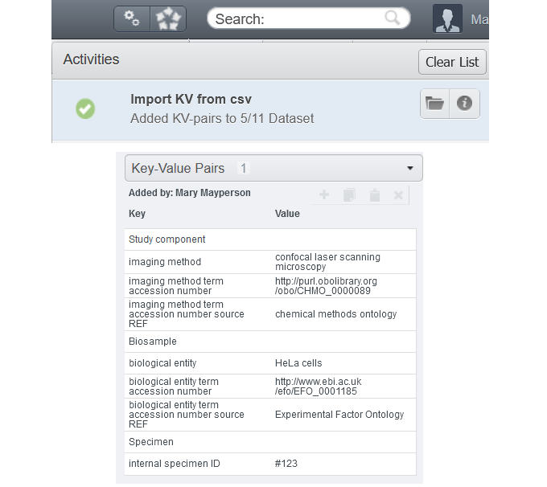
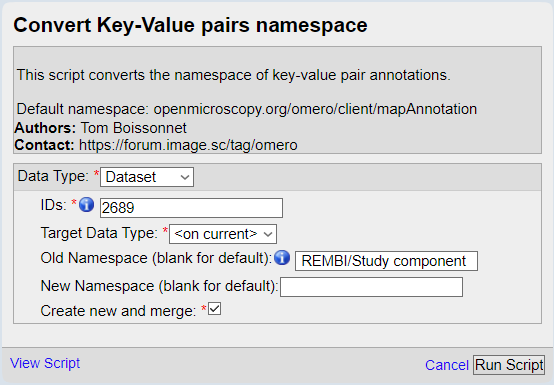
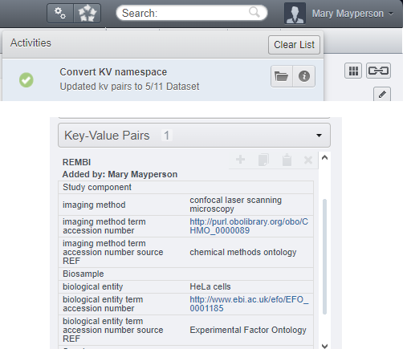
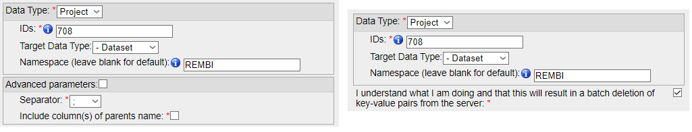

===========
Walkthrough
===========

The aim of the four Key-Value pair scripts is to provide a way to edit \
Key-Value pairs (MapAnnotations) and Tags (TagAnnotations) by batch:

* Import Key-Value pairs and Tags as Annotations from a .csv file
* Export Key-Value pairs to a .csv file
* Delete Key-Value pairs
* Convert the namespaces of Key-Value pairs

Following this walkthrough, we hope to give you an understanding of each \
functionality, including the fourth one on namespaces, likely unclear \
to a newcomer.

Object selection with the scripts
---------------------------------

The object selection is the same for the four scripts. In OMERO there are \
two distinct hierarchies, one for high content screening, and a regular one:

* **Projects** → **Datasets** → **Images**
* **Screens** → **Plates** → (**Wells** or **Acquisition/Run**) → **Images**

More details about selecting High-Content-Screening are described in another \
section (`Selecting HCS <selectHCS>`_).

To select objects to manipulate by batch, the scripts offer three distinct ways.

Direct selection
^^^^^^^^^^^^^^^^
The first is to simply select the all the desired objects. Opening the script \
after selecting the object will prefill the script parameters with the right \
object type and IDs:

For the direct selection, leave the Target Data Type as **<on current>** \
(in this example, choosing **Dataset** would also work).

Children selection
^^^^^^^^^^^^^^^^^^
Instead of selecting the objects one by one, we can select the parent object \
and set the "Target Data Type" to the type of the children objects \
we want to select.

.. image:: images/2_selecting_parentchild_autofill.png

In this example, we would select all the Images contained by the Datasets \
of the Project:701.

Tag selection
^^^^^^^^^^^^^
The third option is to select from a tag all the objects of a given type. \
This grants additional flexibility, either to select objects attached to \
different projects or different owners, or to have a finer control over \
which objects to process.

The selection works in the same way as for the children selection. Note \
that choosing **<on current>** for Target Data Type will result in an \
error in the case of tags.

Exporting Key-Value pairs
-------------------------

Exporting Key-Value pairs will result in a .csv file with the same structure \
you would expect when importing from a .csv file.
As such one can re-create the original file if it is lost or has to be adapted.

Additionally, it can be used to generate a .csv file with a list of object \
names and IDs that we can fill with columns of annotation data later.

   *Exported .csv with only ID and object name*
..

  Tip: If you have Key-Value pairs attached to your objects that you do not \
  wish to export (to create a template like shown above), specify a namespace \
  that is not in use by any of the objects (rolling your head on the keyboard \
  is one possibility).

.. figure:: images/5_export_output_2.png

   *Exported .csv with some test Key-Value pairs*
..

Importing Key-Value pairs
-------------------------

Starting from the file we exported as explained in the previous section, \
we proceed to edit it within a spreadsheet editor.

We added several columns to annotate our dataset with Key-Value pairs \
following the `REMBI <https://doi.org/10.1038/s41592-021-01166-8>`_ guidelines \
(after saving the document, it seems that our ``;`` separator was \
replaced by ``,``).

We proceed and start the script "Import Key-Value from .csv".

A few explanation on the parameters we chose here:

* Data Type & ID: We selected the project containing all of our datasets.
  Only the datasets having their ID in the .csv file will be annotated with
  Key-Value pairs.
* Target data type: We want to annotate dataset (the name and ID inside the .csv
  correspond to datasets).
* File annotation: The .csv file was picked from the local computer via the
  "Choose file" menu (ID of attached file on OMERO could be picked instead).
* Target ID/name colname: These refer to the column names for the columns \
  of either the ID or name of the target objects in the .csv. You can refer to the \
  target objects with both, although names might not be unique.
  In our example the .csv already has the default values the script proposes.

We can see in the OMERO activities that the Key-Value pairs were added to 5 \
datasets out of the 11 present in this project (as expected). One of them \
is shown bellow as an example.

Converting the Key-Value pairs namespace
----------------------------------------

Key-Value pairs are assigned a category/label (known as namespace). \
This grants flexibility so that multiple annotations on one object can be \
processed independantly (like exporting/deleting only those with a given \
namespace).

   In fact, if you created Key-Value pairs in OMERO.web, you have used \
   namespaces without noticing it: OMERO assigns by default the \
   "client namespace" (``openmicroscopy.org/omero/client/mapAnnotation`` in full)\
   , and allows one to edit in OMERO.web annotations in that namespace.

Let's go ahead and change that default client namespace to something else, \
that will assign a category to our Key-Value pairs (and make the Key-Value \
pairs non-editable in the webclient. Note: this does not prevent Key-Value
pairs from other ways that exist to edit them).

And here is our five Key-Value pairs annotations with converted namespace:

Deleting Key-Value pairs
------------------------

To finish, we will show how to delete annotations. It seems that we were \
a bit too fast making the last set of annotations, and some Key-Value \
pairs aren't right.

Before deleting them from OMERO, we make sure to have a local copy \
that we can correct before reimport; Use the Export Key-Value pairs script (\
providing the namespace of the Key-Value pairs to export).

We can now proceed to delete the Key-Value pairs. Selecting \
the same parent object and the same namespace as we just did for the export, \
we can tick the box to confirm that we understand that data will be deleted \
**forever** from the server.

(Exporting on the left, deleting on the right)

We can now edit the mistakes in the .csv file and reupload the Key-Value \
pairs (and why not, specifying the REMBI namespace directly !).

And make sure to check the :doc:`extended description </indepth>` of the scripts to find out what else you can do
with them.

:Authors:
    Tom Boissonnet

:Version: 1.0 of 2023/11/15