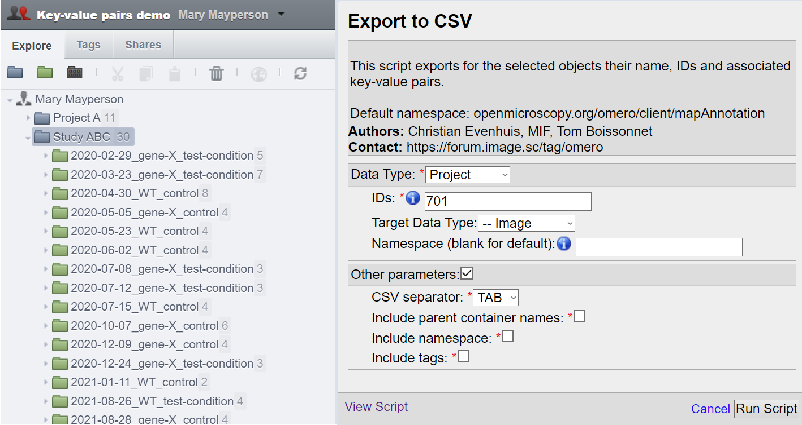
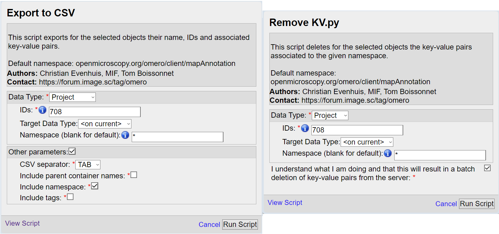

===========
Walkthrough
===========

The aim of the four Key-Value pairs scripts is to provide a way to edit by \
batch the Key-Value pairs annotations:

* Import Key-Value pairs annotations from a .csv file
* Export Key-Value pairs annoatations to a .csv file
* Delete Key-Value pairs annotations
* Convert the namespaces of Key-Value pairs annotations

Following this walkthrough, we hope to give you an understanding of each \
functionality, including the fourth one on namespaces, likely unclear \
to a newcomer.

Object selection with the scripts
---------------------------------

The object selection is the same for the four scripts. In OMERO there are \
two distinct hierarchy, one for high content screening, and a regular one:

* Projects -> Datasets -> Images
* Screens -> Plates -> Wells -> (Acquisition/Run) -> Images

To select objects to manipulate by batch, the scripts offer three distinct ways.

Direct selection
^^^^^^^^^^^^^^^^
The first is to simply select the all the desired objects. Opening the script \
after selecting the object will prefill the script parameters with the right \
object type and IDs:

.. image:: images/1_selecting_all_autofill.png
   :scale: 100%

For the direct selection, leave the Target Data Type as **<on current>** \
so that the script understand to select the currently selected objects \
(in this example, choosing "Dataset" would also work).

Children selection
^^^^^^^^^^^^^^^^^^
Instead of selecting the objects one by one, we can select the parent object \
and set the "Target Data Type" to the type of the children objects \
we want to select.

In this example, we will select all the Images contained by the Datasets \
of the Project:701.

Tag selection
^^^^^^^^^^^^^
The third option is to select from a tag all the objects of a give type. \
This grants additional flexibility, either to select objects attached to \
different projects or different owners, or to have a finer control over \
which objects to process (e.g. in the case of batch deletion).

.. image:: images/3_selecting_tags.png
   :scale: 100%

The selection works in the same way as for the children selection. Note \
that choosing **<on current>** for Target Data Type will result in an \
error in the case of tags.

Exporting Key-Value pairs
-------------------------

We will start the script to export Key-Value pairs. Though there are no\
annotations yet (and we are not expecting you to have annotations either \
for this tutorial), this will generate a .csv file with the list of object \
names and IDs (that we can fill with columns of data later).

Selecting the objects we want to process (we take here the previous example\
of tag selection), let's go ahead and execute the script (leaving the other \
parameters as defaults for now).

.. image:: images/4_export_output.png
   :scale: 100%

As we had no annotations yet, we obtain only the dataset name and id as \
expected. Would we had Key-Value pairs attached to the dataset, \
they would have been exported here (given that we would specify the right \
namespace).\

  Tip: If you have Key-Value pairs attached to your objects that you do not \
  wish to export (to create a template like shown above), specify a namespace \
  that is not in use by any of the objects (try the frantically typed \
  sequence "lkdsjfvjpsodfp2")

Importing Key-Value pairs
-------------------------

Starting from the file we exported as explained in the previous section, \
we proceed to edit it within a spreadsheet editor.

.. image:: images/5_KV_to_import.png
   :scale: 100%

We added several columns to annotate our dataset with Key-Value pairs \
following the `REMBI <https://doi.org/10.1038/s41592-021-01166-8>`_ guidelines \
(after saving the document, it seems that our ``;`` separator was \
replaced by ``,``).

We proceed and start the script "Import Key-Value from .csv".

.. image:: images/6_script_import.png
   :scale: 100%

A few explanation on the parameters we chose here:

* Data Type & ID: We selected the project containing all of our datasets.
  Only the datasets having their ID in the .csv file will be annotated with
  Key-Value pairs.
* Target data type: We want to annotate dataset (the name and ID inside the .csv
  correspond to datasets).
* File annotation: The .csv file was picked from the local computer via the
  "Choose file" menu (ID of attached file on OMERO could be picked instead).

We can see in the OMERO activities that the Key-Value pairs were added to 5 \
datasets out of the 11 present in this project (as expected). One of them \
is shown bellow as an example.

.. image:: images/7_KV_import_printout.png
   :scale: 100%

Converting the Key-Value pairs namespace
----------------------------------------

Key-Value pairs are assigned a category/label (known as namespace). \
This grants flexibility so that multiple annotations on one object can be \
processed differently (like exporting/deleting only those with a given \
namespace).

   In fact, if you created Key-Value pairs in OMERO.web, you have used \
   namespaces without noticing it: OMERO assigns by default the \
   "client namespace" (``openmicroscopy.org/omero/client/mapAnnotation`` in full)\
   , and allows one to edit annotations with such namespace.

Let's go ahead and change that default client namespace to something else, \
that will assign a category to our Key-Value pairs (and make the Key-Value \
pairs non-editable in the webclient, stopping us from inadvertently modifing \
them).

.. image:: images/8_convert_namespace.png
   :scale: 100%

And here is our five Key-Value pairs annotations with converted namespace:

.. image:: images/9_converted_KV.png
   :scale: 100%

Deleting Key-Value pairs
------------------------

To finish, we will show how to delete annotations. It seems that we were \
a bit too fast making the last set of annotations, and some Key-Value \
pairs aren't right. We have added in this tutorial only five of them, so \
correcting by hand is an option. But with the batch annotation of hundreds of \
objects (when dealing with plates for example), this is no longer possible.

Before deleting anything from OMERO, make sure that you have a local copy \
that we can correct before reimport; Use the Export Key-Value pairs script (\
indicate the namespace of the Key-Value pairs to export if you used one).

We can now proceed to delete the Key-Value pairs (as we have the .csv file of \
all the annotations for the given namespacewe are about to delete). Selecting \
the same parent object and the same namespace as we just did for the export, \
we can tick the box to confirm that we understand that data will be deleted \
forever from the server.

(Exporting on the left, deleting on the right)

We can now edit the mistakes in the .csv file and reupload the Key-Value \
pairs (and why not, specifying the REMBI namespace directly !)

:Authors:
    Tom Boissonnet

:Version: 1.0 of 2023/11/15