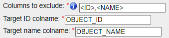
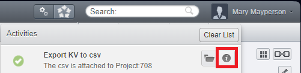
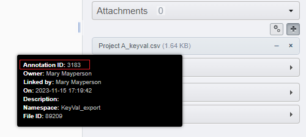

Extended description
====================

Selecting High-Content-Screening
--------------------------------
Selecting HCS data is not really special, and the logic is the same as for \
Projects/Datasets/Images: Select a plate, ask for all Wells inside it and \
you will be processing all the Wells of that Plate.

One specificity though is about the Run/Acquisition. Runs and Wells are both \
children objects of a Plate and can be selected in this way. \
But selecting Images from a Run or all the Wells of a plate will produce different \
results (in the case there is more than one Run):

  * Selecting Images from a list of Wells will select all the images inside
    those Wells.
  * Selecting Images from a Run will select all the images coming from that
    Run (would correspond to a subset of Images from each Well).
  * Selecting Images from a Screen or a Plate will follow the Well route.

Choosing the CSV separator
--------------------------
When importing annotations from a .csv file, the default setting is to try \
to detect automatically the separator used in the .csv (one of , ; TAB).

It is possible to specify directly which one is used (in the case the automatic\
detection would fail for example). As the text in the annotations may contain \
commas or semi-column, it is recommended to use TAB as separators to avoid \
undesired outcomes.

Columns of parent names
-----------------------
A parameter of the export script is to include the name of the parent objects. \
This serves as additional information when generating the object list, so that \
the objects can be identified easily when adding columns of annotations while \
updating the .csv in a spreadsheet editor.
Those columns should subsequently be excluded from the Key-Value pairs, either \
by dropping them out of the .csv, or by adding the name of those columns inside \
the corresponding parameter of the import script.

Default Namespace
-----------------
Leaving the namespace parameter to blank always refers to the same namespace, \
the "Client namespace", corresponding to the one given to new Key-Value pairs \
created inside OMERO.web. This namespace \
(``openmicroscopy.org/omero/client/mapAnnotation`` in full) is treated \
differently by OMERO.web as it is the only one that can be edited in its \
interface.

Adding tags from .csv
---------------------
Congratulation for reading the docs. Here is an easter egg for you. \
You can add tags from the Key-Value pairs script, by adding columns named \
exactly <TAG> in your .csv.  TODO

Annotating from multiple CSV
----------------------------

Target ID, name and excluding column from Key-Value pairs
---------------------------------------------------------
The defaults for the IDS and names of the objects to annotate are the same for \
all object types, and is used by the export script: OBJECT_ID and OBJECT_NAME. \
As not all may want to follow this naming, we added options to indicate what are \
the name of the column that references the objects to annotate.

While OBJECT_NAME are not used to identify the objects when OBJECT_ID is found, \
it remains important to have it inside the .csv to recognize the objects more \
easily inside a spreadsheet editors.

Additionaly, to follow on the legacy of the previous script version, \
OBJECT_ID column is optional (if not found in the document, it will attempt \
to match the objects by name). We recommend however to use the ID whenever \
possible, as it removes all ambiguity and may prevent accidents.

Note also that those two columns are excluded by defaults from the Key-Value \
pairs, by the use of the following three parameters:

  * Target ID colname: the name of the column in the .csv that contains the
    objects IDs
  * Target name colname: the name of the column in the .csv that contains the
    objects names
  * Columns to exclude: <ID> will exclude the column containing the objects IDs,
    <NAME> will do the same for the objects names, and additional columns can
    be excluded by indicating their name (e.G. to exclude parent objects
    column name when used with the export script).

Why the checkbox for delete script
----------------------------------
If you are not afraid of batch deletion processes, well, you should be. \
Because there is no undo button, deleting may result in a great loss of data. \
Be sure to back up first the annotations by exporting it to a .csv (using the \
exact same selection rule). \

We hope that by forcing you to tick that box you will remember to think twice \
about what is about to happen, and even more especially when you are the Owner \
of an OMERO group (thus able to delete anyone's annotations). You have been \
warned.

Looking at the output Log
-------------------------
When the execution of the script is over (also when it fails), you will \
be able to look at the ouput of the script by clicking that button highlighed \
in red in the picture bellow.

This output will help you understand what has been done/changed, and may help \
you understand things when they don't work out the way you expected them.

Assertion errors explained
--------------------------

<Something> is not a valid target for <SomethingElse>
^^^^^^^^^^^^^^^^^^^^^^^^^^^^^^^^^^^^^^^^^^^^^^^^^^^^^
Objects are selected from a parent object TO a child object. Check out \
this section for more explanations on how to select objects with \
those scripts.

No .csv FileAnnotation was found on <OBJ_TYPE>:<OBJ_ID>
^^^^^^^^^^^^^^^^^^^^^^^^^^^^^^^^^^^^^^^^^^^^^^^^^^^^^^^
When providing no file from the select File button, nor giving \
a file annotation to read Key-Value pairs from, the script attempt to \
search specifically for a .csv file attached to the current parent object.
If none is found, you obtain this error. Try to provide a .csv file instead \
of letting the script guessing.

Failed to sniff CSV delimiter
^^^^^^^^^^^^^^^^^^^^^^^^^^^^^
It happens that the sniffer to detect fails to understand what separator was \
used inside you .csv file. Please indicate in the parameter the separator used \
inside your .csv.

The provided annotation ID must reference a FileAnnotation
^^^^^^^^^^^^^^^^^^^^^^^^^^^^^^^^^^^^^^^^^^^^^^^^^^^^^^^^^^
The ID of the file annotation seems incorrect. Make sure that you gave the \
FileAnnotation ID and not the LinkAnnotation ID, as indicated in the image bellow.

Neither the column for the objects name or the objects index were found
^^^^^^^^^^^^^^^^^^^^^^^^^^^^^^^^^^^^^^^^^^^^^^^^^^^^^^^^^^^^^^^^^^^^^^^
Make sure that the column in your .csv match the columns given as parameter \
of the import script. Both are optional, but at least one is required!

Target objects identified by name have duplicate
^^^^^^^^^^^^^^^^^^^^^^^^^^^^^^^^^^^^^^^^^^^^^^^^
Because no column specifying the ID of the object to annotate was found, \
the script attempted to uniquely identify the objects by their name. It seemed \
however that in the list of all objects founds from the parent you gave, \
multiple objects have the same name. Please try again by adding a column \
with the IDs of the objects to annoate. (OBJECT_ID is the default of the \
scripts).

File annotation ID must be given when using Tag as source
^^^^^^^^^^^^^^^^^^^^^^^^^^^^^^^^^^^^^^^^^^^^^^^^^^^^^^^^^
Because files cannot be attached to tags, and thus cannot be searched \
automatically when providing tags as source, you must provide a file as \
input to the script.

Number of Source IDs and FileAnnotation IDs must match
^^^^^^^^^^^^^^^^^^^^^^^^^^^^^^^^^^^^^^^^^^^^^^^^^^^^^^
When providing more than one parent object, the Key-Value pairs can \
be read from either a single .csv file, or by multiple files. In the later \
scenario, there must be an identical number of FileAnnotation and parent \
objects, in order for the script to understand which corresponds to which.

Please confirm that you understood the risks
^^^^^^^^^^^^^^^^^^^^^^^^^^^^^^^^^^^^^^^^^^^^
It seems that you forgot to confirm that you understood the risk associated \
with a batch deletion of annotations. TODO cf to section on why ticking the box.