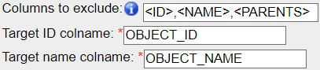

====================
Extended description
====================

.. _select-HCS:

Selecting High-Content-Screening
--------------------------------
Selecting HCS data follows the same selection logic as for \
Projects/Datasets/Images: Select a Plate, ask for all Wells inside it and \
you will be processing all the Wells of that Plate.

One specificity though is about the Run/Acquisition. Runs and Wells are both \
children objects of a Plate and can be selected in this way. \
But selecting Images from a Run or all the Wells of a plate will produce different \
results (when there is more than one Run):

  * Selecting **Images** from a list of **Wells** will select all the **Images** inside
    those **Wells**.
  * Selecting **Images** from a **Run** will select all the **Images** coming from that
    **Run** (would correspond to a subset of **Images** from each **Well**).
  * Selecting **Images** from a **Screen** or a **Plate** will follow the **Well** route selecting all **Images** inside all **Wells**.

KeyVal_from_csv
---------------

Features
^^^^^^^^
* Generation of Key-Value pairs
* Automatic Generation of multiple Key-Value pairs with the same Key if multiple Values are separated by a defined character
* Supports generation of Key-Value pairs with different namespaces than the OMERO default one
* Automatic exclusion of Key-Value pairs with empty Values
* Generation of Tags
   * Supports Tag Sets
   * Supports selection of Tags by Tag IDs
   * Creation of new Tags and Tag Sets
   * Allows restriction to personal Tags only
* Target selection by Tags

Exclude empty values from import
^^^^^^^^^^^^^^^^^^^^^^^^^^^^^^^^
If you utilise a .csv with empty values like

.. csv-table::
   :header: "name", "id", "manual analysis", "observation"
   :widths: 20, 10, 20,20

   "A.tif", "120", "Hit",""
   "B.jpg", "121", "",""
   "C.jpg","122","","missing"

by default, the empty cells are skipped during Key-Value pairs creation.
If you wish to create a key for those empty cells, you can uncheck the box "*Exclude empty values*"

This might be useful if you plan to fill it in manually later on. If you used an empty key value pair as a title \
of a "key-value pair section", consider instead to assign a :ref:`namespace` to each of your key-value pair subset.

Multiplicating Keys
^^^^^^^^^^^^^^^^^^^
If you utilise the Advanced parameter "*Split value on*" you can specify one character \
for which multiple values get split. E.g. setting this to "!" in the following example, \
it would lead to the creation of two Key-Value pairs ``key_1 : value_1`` and ``key_1 : value_2`` \
for the Image *A.jpg*. Despite looking like a list of multiple values for Image *B.tif* it \
would generate one Key-Value pair ``key_1 : value_1, value_2`` as the comma is not recognized \
in our example as a separator for multiple Key-Value pairs.

.. csv-table::
   :header: "name", "id", "key_1"
   :widths: 20, 10, 20

   "A.tif", "120", "value_1!value_2"
   "B.jpg", "121", "value_1, value_2"
   "C.jpg","122","value_1!"

Be aware, that for the Image *C.jpg* two Key-Value pairs ``key_1 : value_1`` and ``key_1 :`` would be created if the "*Exclude empty values*" parameter is unchecked.

Namespaces
^^^^^^^^^^
The default namespace for OMERO Key-Value pairs generated in the web-interface and by our script is *openmicroscopy.org/omero/client/mapAnnotation*.
Only Key-Value pairs with this namespace can be edited in the web-interface later!
Leaving the "**Namespace**" parameter blank will lead to the creation of all Key-Value pairs with the default namespace.
With this parameter you can choose a custom namespace for all Key-Value pairs.
Additionally, you can choose to use custom namespaces, e.g. to utilize the `OMERO-Mapr <https://github.com/ome/omero-mapr>`_ functionalities, for each different Key.
To do so just add a first row in the .csv with the first column containing "**namespace**". The corresponding namespace for each key is then put above the respective key. If no namespace is given, the script will fall back to the default namespace.

+------------+------------+-----------+------------------------+
| namespace  |            | Custom_NS |REMBI_Biosample         |
+------------+------------+-----------+------------------------+
| name       | id         | key_1     |  Organism              |
+============+============+===========+========================+
| A.tif      | 120        | value_1   |Drosophila melanogaster |
+------------+------------+-----------+------------------------+
| B.jpg      | 121        | value_2   |Mus musculus            |
+------------+------------+-----------+------------------------+
| C.jpg      | 122        | value_1   |Saccharomyces cerevisiae|
+------------+------------+-----------+------------------------+

Tags
^^^^
One can not only annotate with Key-Value pairs but also with Tags.
To do this simply put "**tag**" where you would normally put the Key name. Multiple \
Tags can be specified as a comma separated list (if no separator is given in "Split value on", see :ref:`multiplicating keys`)

If you want to select a Tag in a specific Tag-Set you just add the Tag-Set in square \
brackets directly following the Tag. You can also specify the Tag by its Tag-Id in \
square brackets directly following the Tag.
By default the script will not create new Tags to avoid "Tag bloat", if you want new Tags created according \
to the .csv values you have to check the "**Create new Tags**" checkbox under "**Advanced parameters**".

Furthermore, by default the script will search through all available Tags of the group, \
if you want to use only your own Tags you have to check the "**Use only personal Tags**" checkbox \
under "**Advanced parameters**".

.. csv-table::
   :header: "name", "id", "tag"
   :widths: 20, 10, 20

   "A.tif", "120", "Tag_1, Tag_2, Tag_3"
   "B.jpg", "121", "Tag_1[Tag-Set]"
   "C.jpg","122","Tag_1[Tag-Id]"

.. figure:: images/Script_Interface.png
   :width: 60%

   *Script interface*
..

Choosing the CSV separator
--------------------------
When importing annotations from a .csv file, the script tries by default \
to detect the CSV separator automatically (one of , ; TAB).

It is possible to specify directly which one is used (in the case the automatic \
detection fails for example). As the text in the annotations may contain \
commas or semi-column, it is recommended to use TAB as separators.

Columns of parent names
-----------------------
A parameter of the export script is to include the name of the parent objects. \
This serves as additional information when generating the object list, so that \
the objects can be identified easily when adding columns of annotations while \
updating the .csv in a spreadsheet editor.
Those columns are by default excluded from the Key-value pairs using the import \
script (<PARENT> value of the "Columns to exclude" parameter matches all parent \
containers: PROJECT, DATASET, SCREEN, PLATE, WELL and RUN)

Default Namespace
-----------------
Leaving the namespace parameter to blank always refers to the same namespace, \
the "Client namespace", corresponding to the one given to new Key-Value pairs \
created inside OMERO.web. This namespace \
(``openmicroscopy.org/omero/client/mapAnnotation`` in full) is treated \
differently by OMERO.web as it is the only one that can be edited in its \
interface.

Target ID, name and excluding column from Key-Value pairs
---------------------------------------------------------
The defaults for the IDS and names of the objects to annotate are the same for \
all object types, and is used by the export script: OBJECT_ID and OBJECT_NAME. \
As not all may want to follow this naming, we added options to indicate what are \
the name of the column that references the objects to annotate.

While OBJECT_NAME are not used to identify the objects when OBJECT_ID is found, \
it remains important to have it inside the .csv to recognize the objects more \
easily inside a spreadsheet editors.

Additionaly, to follow on the legacy of the previous script version, \
OBJECT_ID column is optional (if not found in the document, it will attempt \
to match the objects by name). We recommend however to use the ID whenever \
possible, as it removes all ambiguity and may prevent accidents.

Note also that those two columns are excluded by defaults from the Key-Value \
pairs, by the use of the following three parameters:

* Target ID colname: the name of the column in the .csv that contains the
  objects IDs
* Target name colname: the name of the column in the .csv that contains the
  objects names
* Columns to exclude: <ID> will exclude the column containing the objects IDs,
  <NAME> will do the same for the objects names, and additional columns can
  be excluded by indicating their name (e.G. to exclude parent objects
  column name when used with the export script).

Why the checkbox for delete script
----------------------------------
There is no undo button, deleting may result in a loss of data. \
If you are unsure, back up first the annotations by exporting it to a .csv (using the \
same selection rule and specifying the same namespace).

Looking at the output log
-------------------------
When the execution of the script is over (also when it fails), you will \
be able to look at the ouput of the script by clicking that button highlighed \
in red in the picture bellow.

.. image:: images/expert_2_script_output.png

This output will help you understand what has been done/changed, and may help \
you understand things when they don't work out the way you expected them.