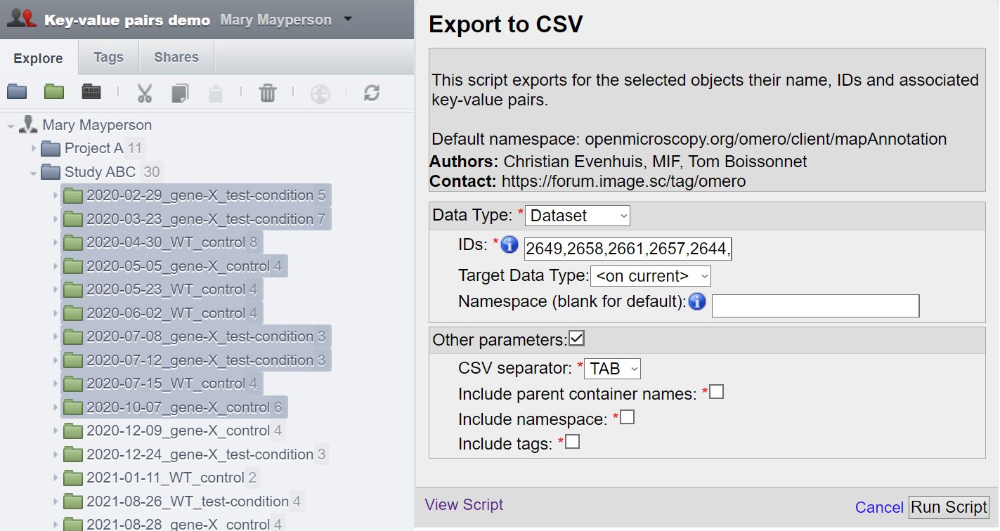
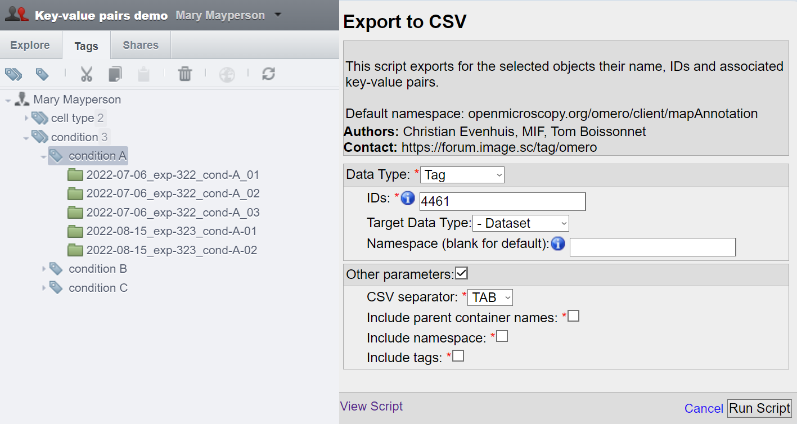
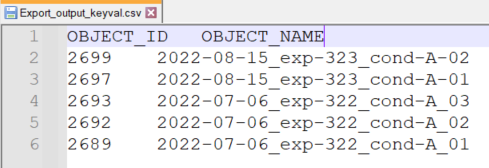
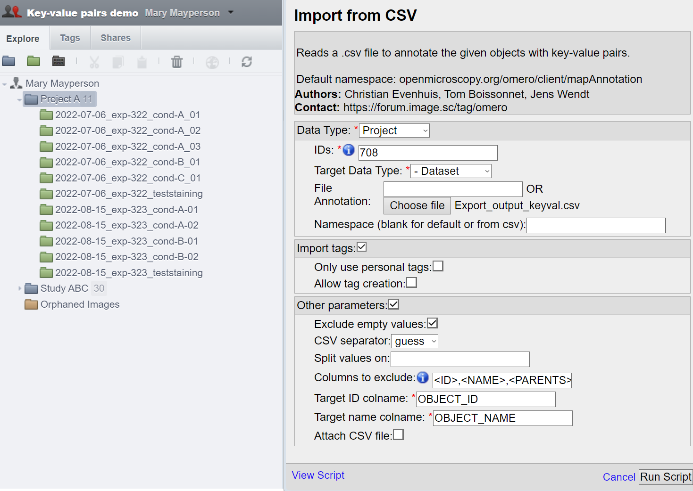
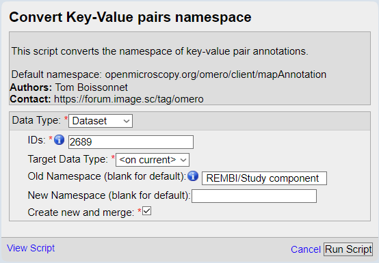

===========
Walkthrough
===========

The aim of the four Key-Value pair scripts is to provide a way to edit \
Key-Value pairs (MapAnnotations) and Tags (TagAnnotations) by batch:

* Import Key-Value pairs and Tags as Annotations from a .csv file
* Export Key-Value pairs to a .csv file
* Delete Key-Value pairs
* Convert the namespaces of Key-Value pairs

Following this walkthrough, we hope to give you an understanding of \
the four scripts that will help you to manipulate your annotations.

Object selection with the scripts
---------------------------------

The object selection logic is the same for all four scripts. In OMERO there are \
two distinct hierarchies:

* **Projects** → **Datasets** → **Images**
* **Screens** → **Plates** → (**Wells** or **Acquisition/Run**) → **Images**

More details about selecting High-Content-Screening are given in another \
section (see :doc:`Selecting High-Content-Screening </indepth>`).

To select which objects to manipulate by batch, the scripts offer three distinct ways.

Direct selection
^^^^^^^^^^^^^^^^
The first is to simply select the all the desired objects. Opening the script \
after selecting the object will prefill the script parameters with the right \
object type and IDs:

   *Selection of multiple datasets and the auto-filled Export to CSV script.*
..

For the direct selection, leave the Target Data Type as "*<on current>*" \
(in this example, choosing **Dataset** would also work).

Children selection
^^^^^^^^^^^^^^^^^^
Instead of selecting the objects one by one, we can select the parent object \
and set the "*Target Data Type*" to the type of the children objects \
we want to select.

.. figure:: images/2_selecting_parentchild_autofill.png

   *Selection of all the images of a project and the auto-filled Export to CSV script.*
..

In this example, we would select all the **Images** found under the **Project:701**.

Tag selection
^^^^^^^^^^^^^
The third option is to select from a tag all the objects of a given type. \
This grants additional flexibility, either to select objects attached to \
different projects or different owners, or to have a finer control over \
which objects to process.

   *Selection of a subset of datasets from a tag and the auto-filled Export to CSV script.*
..

The selection works in the same way as for the children selection. Note \
that choosing "*<on current>*" for "*Target Data Type*" will result in an \
error in this case.

Exporting Key-Value pairs
-------------------------

Exporting Key-Value pairs will generate a .csv file with the header names \
expected by the import .csv script. This has two use:

* export existing key-value pairs (along other things like namespace or tags).
  This can be useful to modify them before re-import, or to transfer annotations
  across groups.
* export a list of objects with their name and ID.

   *Exported .csv with only the object ID and name*
..

  Tip: If you have Key-Value pairs attached to your objects that you do not \
  wish to export (to create a template like shown above), specify a not-in-use \
  namespace (any random input will work).

Importing Key-Value pairs
-------------------------

Starting from the file we exported as explained in the previous section, \
we proceed to edit it within a spreadsheet editor, adding more columns to the csv, \
including a row specifying the namespace to assign for each key:

.. figure:: images/5_KV_to_import.png

   *Result of populating the csv shown in a text editor*
..

We added several columns to annotate our dataset with Key-Value pairs \
following the `REMBI <https://doi.org/10.1038/s41592-021-01166-8>`_ guidelines \
(after saving the document, our ``TAB`` separator became ``,``).

We proceed and start the script "*Import Key-Value from .csv*".

   *Selection of all the datasets of a project and the Import from CSV script.*
..

There are many parameters here that could help you fine tune the way to import annotations. More \
  on that in the :doc:`parameter description section</allparameters>` of this guide.

We can then see in the OMERO activities that the Key-Value pairs were added to 5 \
datasets out of the 11 present in this project (as expected). We also see three set of \
key-value pairs, one for each namespace we used in the csv.

.. figure:: images/7_KV_import_printout.png

  *The script output (5 entries in the csv matched to 5 dataset out of 11) and the\
  resulting key-value pairs annotation.*
..

Converting the Key-Value pairs namespace
----------------------------------------

Key-Value pairs are assigned a category/label (known as namespace). \
This grants flexibility so that different annotations can be \
distinguished or isolated (like for exporting/deleting only those with a given \
namespace).

   In fact, if you created Key-Value pairs in OMERO.web, you have used \
   namespaces without noticing it: OMERO assigns by default the \
   "client namespace" (``openmicroscopy.org/omero/client/mapAnnotation`` in full)\
   , a special namespace recognized by OMERO.web allowing to edit them.

We would like to do a few changes in OMERO.web, and for that we would need to \
change the namespace to the default OMERO.web namespace. We indicate the namespace we \
want to edit and leave the second field empty (default namespace is then used).

  *The script to convert the namespace of key-value pairs annotations.*
..

And here is our five Key-Value pairs annotations with converted namespace:

.. figure:: images/9_converted_KV.png

  *The script output (5 dataset had annotations with the default namespace) and the\
  resulting key-value pairs annotation.*
..

Deleting Key-Value pairs
------------------------

It turns out that there are more than a few edits to do on our key-value pairs, and \
converting back and forth the namespace seems too tedious this time. Let's instead export \
what we have so far (we have done edits that we don't want to lose), delete "old" the key-value pairs, \
and reimport when we are done fixing them.

Using the same selection inputs for both scripts, we make sure that we have the key-value pairs on our \
computer before deleting them. Because we want to export/delete multiple namespace at once, we can use the ``*`` \
to include all namespace.

Because there is no undo with the deletion of data from OMERO, think twice while checking the confirmation box and clicking \
the "Run script" button.

.. figure:: images/10_export_delete.png

  *The two scripts used one after another. Export the annotations for backup \
  before removing them from the server with the Remove KV script.*
..

We can now edit the mistakes in the .csv file and reupload the Key-Value \
pairs!.

Make sure to check the :doc:`extended guide </indepth>` to learn about what else you can \
do with those scripts.

:Authors:
    Tom Boissonnet

:Version: 1.0 of 2024/03/01